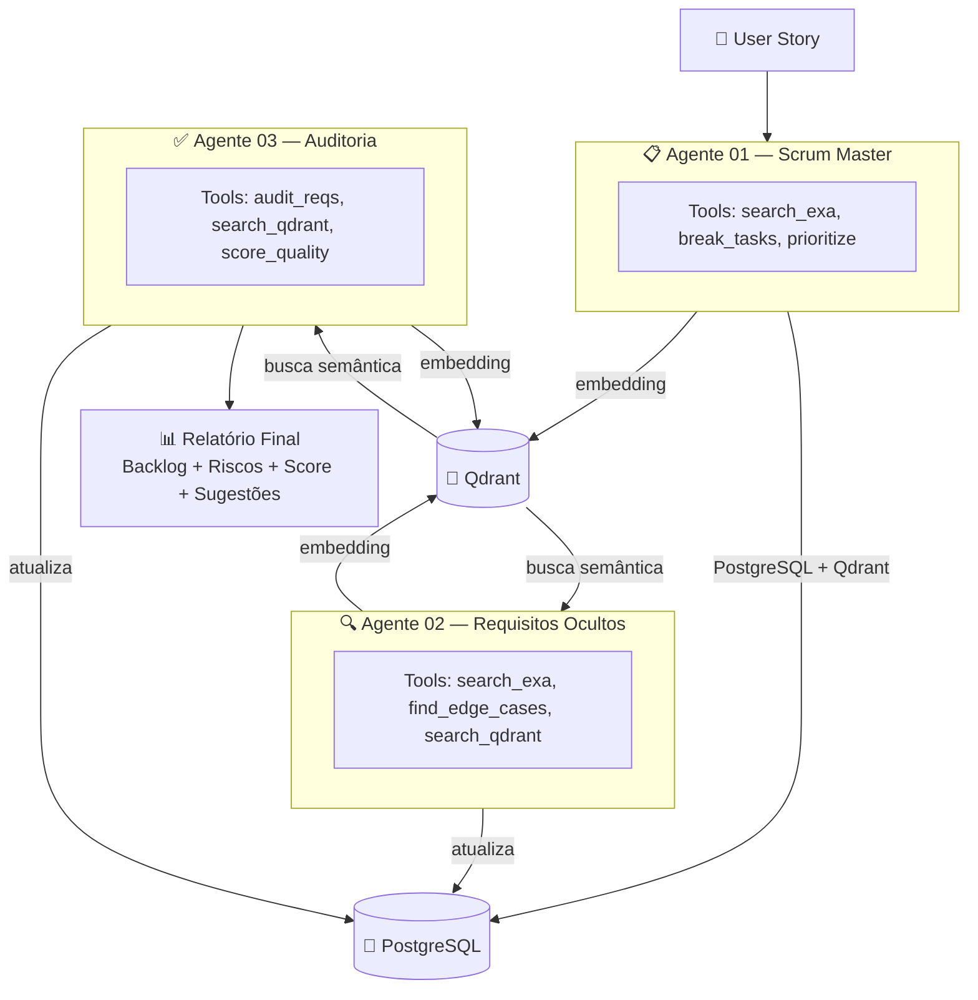

# Multi-Agentes User Story Backlogs

Sistema multi-agente que transforma user stories em backlog técnico completo usando LLMs (Gemini), busca semântica (Qdrant) e persistência relacional (PostgreSQL).

## Arquitetura



## Estrutura do Projeto

```
├── .dockerignore             # Arquivos ignorados no build Docker
├── .env.example              # Template de variáveis de ambiente
├── .gitignore                # Arquivos ignorados pelo Git
├── .python-version           # Versão do Python (3.13)
├── docker-compose.yml        # Orquestração: PostgreSQL + Qdrant + App
├── Dockerfile                # Imagem da aplicação Python
├── init.sql                  # Schema inicial do banco de dados
├── LICENSE                   # Licença do projeto
├── pyproject.toml            # Dependências e config do projeto (uv)
├── README.md                 # Este arquivo
├── uv.lock                   # Lock de dependências
│
└── src/
    ├── __init__.py            # Marca src como pacote Python
    ├── main.py                # Ponto de entrada do pipeline
    ├── utils.py               # Código compartilhado (extract_json, genai client)
    ├── README.md              # Documentação interna do src
    │
    ├── agente_01_scrum/       # 📋 Scrum Master
    │   ├── __init__.py        # Exporta ScrumAgent
    │   ├── agent.py           # Lógica do agente (automatic function calling)
    │   ├── tools.py           # search_exa, break_tasks, prioritize
    │   ├── prompts.py         # System prompt + formato de saída JSON
    │   └── README.md          # Docs do agente
    │
    ├── agente_02_requisitos/  # 🔍 Requisitos Ocultos
    │   ├── __init__.py        # Exporta RequirementsAgent
    │   ├── agent.py           # Lógica do agente (entrada via Qdrant)
    │   ├── tools.py           # search_exa, find_edge_cases, search_qdrant
    │   ├── prompts.py         # System prompt + formato de saída JSON
    │   └── README.md          # Docs do agente
    │
    ├── agente_03_auditoria/   # ✅ Auditoria
    │   ├── __init__.py        # Exporta AuditAgent
    │   ├── agent.py           # Lógica do agente (cruza Agente 01 + 02 via Qdrant)
    │   ├── tools.py           # audit_reqs, search_qdrant, score_quality
    │   ├── prompts.py         # System prompt + formato de saída JSON
    │   └── README.md          # Docs do agente
    │
    ├── memory/                # 💾 Camada de persistência
    │   ├── __init__.py        # Exporta funções de db e qdrant
    │   ├── db.py              # PostgreSQL (save/update pipeline_runs)
    │   └── qdrant_client.py   # Qdrant (save/search embeddings)
    │
    └── orchestrator/          # 🚀 Orquestrador
        ├── __init__.py        # Exporta AgentPipeline
        └── pipeline.py        # Conecta os 3 agentes em sequência
```

## Pré-requisitos

- Docker e Docker Compose
- Chave da API Gemini — [Google AI Studio](https://aistudio.google.com/apikey)
- Chave da API Exa — [Exa](https://exa.ai)

## Setup

1. Clone o repositório e copie o `.env`:

```bash
cp .env.example .env
```

2. Preencha as chaves no `.env`:

```
GEMINI_API_KEY=sua_chave_gemini
EXA_API_KEY=sua_chave_exa
```

3. Suba os containers:

```bash
docker compose up -d
```

4. Execute o pipeline:

```bash
docker compose run --rm app uv run python -m src.main
```

## Pipeline

| Etapa | Agente | Input | Output | Docs |
|---|---|---|---|---|
| 1 | Scrum Master | User Story | Backlog priorizado (RICE) + critérios de aceitação | [README](src/agente_01_scrum/README.md) |
| 2 | Requisitos Ocultos | User Story + Qdrant (backlog) | Casos de borda, riscos, dependências, gaps | [README](src/agente_02_requisitos/README.md) |
| 3 | Auditoria | User Story + Qdrant (backlog + requisitos) | Scores de qualidade, gaps, sugestões, relatório | [README](src/agente_03_auditoria/README.md) |

## Stack

| Componente | Tecnologia |
|---|---|
| LLM | Gemini 2.5 Flash (Google GenAI SDK) |
| Busca externa | Exa API |
| Banco vetorial | Qdrant |
| Embeddings | all-MiniLM-L6-v2 (sentence-transformers) |
| Banco relacional | PostgreSQL 17 |
| ORM | SQLAlchemy |
| Gerenciador de deps | uv |
| Runtime | Python 3.13 |

## Banco de Dados

A tabela `pipeline_runs` armazena o resultado de cada execução:

| Coluna | Tipo | Descrição |
|---|---|---|
| `user_story` | TEXT | Story original informada |
| `agente_01_resultado` | JSONB | Backlog com tasks, RICE, critérios |
| `agente_02_resultado` | JSONB | Riscos, edge cases, dependências |
| `agente_03_resultado` | JSONB | Scores, gaps, sugestões, relatório |

## Variáveis de Ambiente

| Variável | Descrição |
|---|---|
| `GEMINI_API_KEY` | Chave da API Google Gemini |
| `EXA_API_KEY` | Chave da API Exa |
| `GEMINI_MODEL` | Modelo Gemini (padrão: gemini-2.5-flash) |
| `POSTGRES_USER` | Usuário do PostgreSQL |
| `POSTGRES_PASSWORD` | Senha do PostgreSQL |
| `POSTGRES_DB` | Nome do banco |
| `DATABASE_URL` | Connection string do PostgreSQL |
| `QDRANT_HOST` | Host do Qdrant |
| `QDRANT_PORT` | Porta do Qdrant |
